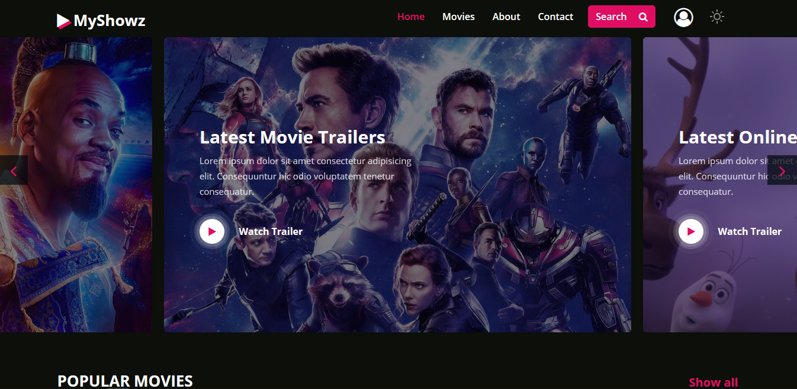
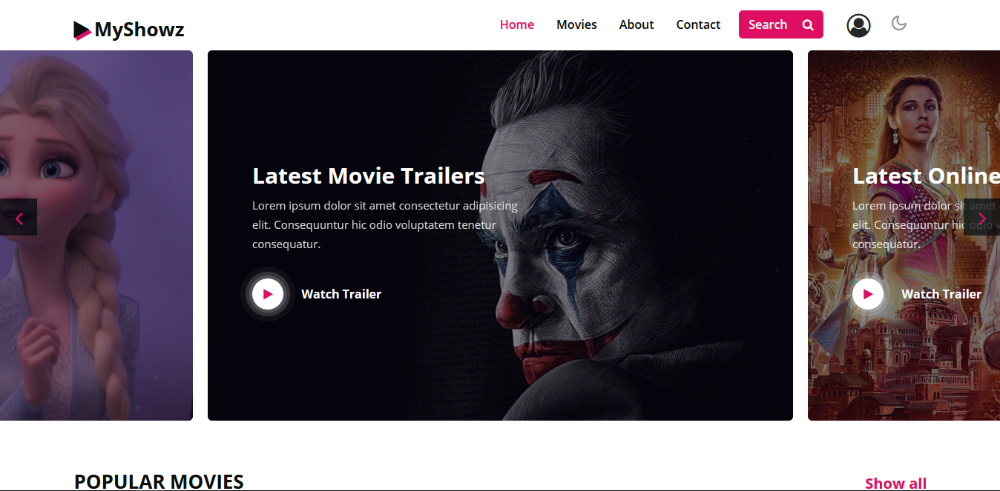
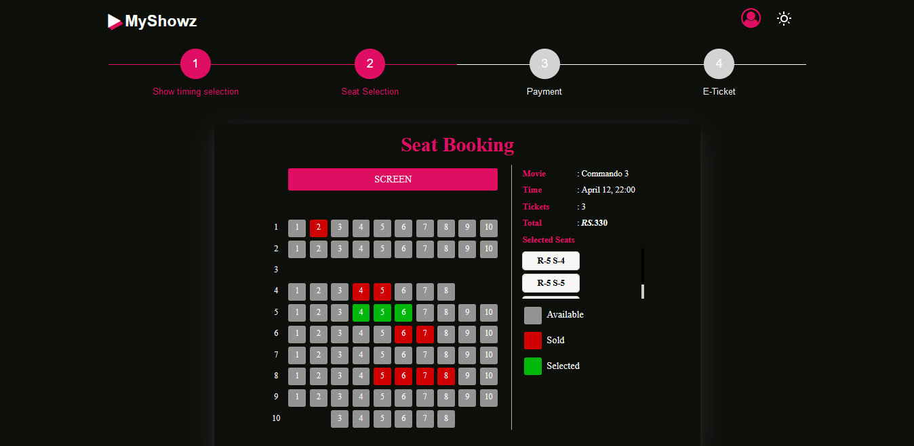
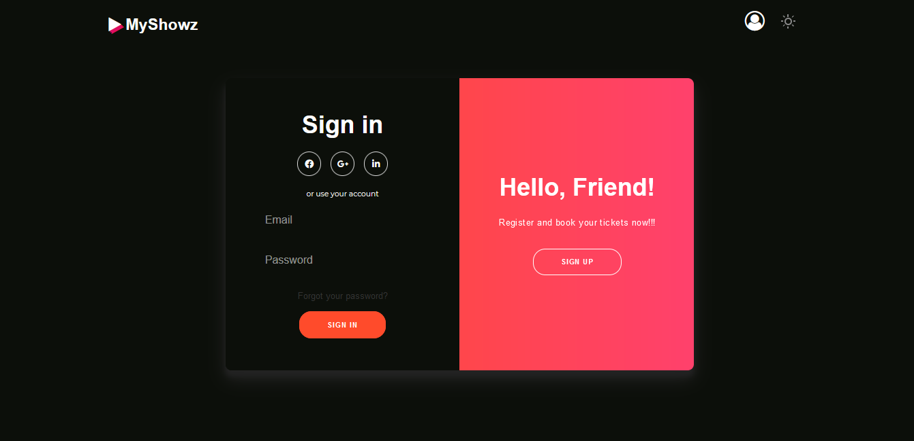

# MyShowz-Movie-ticket-booking-website
MYSHOWZ is a frontend movie ticket booking website developed using HTML, CSS, JavaScript, and Bootstrap. The project focuses on creating an interactive and user-friendly movie booking experience, with features such as movie browsing, seat selection, ticket booking, sign-in, and dark/light mode.

## Demo
http://myshowz.infinityfreeapp.com/

# Glimpse of the Website
## Home page in the dark mode

## Home page in the light mode

## Seat selection page in the dark mode

## SignIn-SignUp page in the dark mode

## Credits

## Bootstrap Layout 
https://w3layouts.com/tag/bootstrap-templates/
